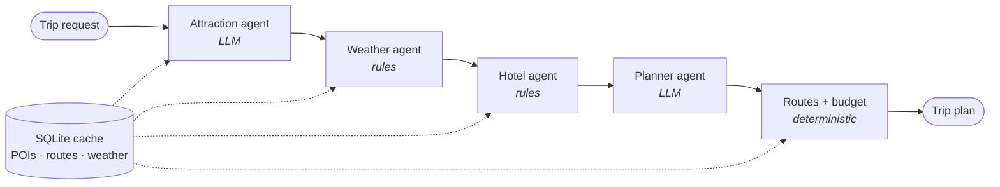

# TravelGuideMaster

A multi-agent travel planner for New Zealand. Give it a destination, dates,
what you are travelling for and how you like to spend, and it returns a
day-by-day itinerary with a map, driving routes, a place to stay, a weather
outlook and a cost estimate — all of which you can then edit.

**Live demo:** <https://travel.nz-travel-plan-master.online>
The demo asks for an access code. For a trial code, contact
[Jinchun Shi on LinkedIn](https://www.linkedin.com/in/jinchun-shi-624311389/).

Built by Jinchun (Steven) Shi for COMPX576 at the University of Waikato.

---

## Contents

- [TravelGuideMaster](#travelguidemaster)
  - [Contents](#contents)
  - [What it does](#what-it-does)
  - [How it works](#how-it-works)
    - [Design decisions worth knowing](#design-decisions-worth-knowing)
  - [Tech stack](#tech-stack)
  - [Repository layout](#repository-layout)
  - [Running it locally](#running-it-locally)
    - [Prerequisites](#prerequisites)
    - [Backend](#backend)
    - [Frontend](#frontend)
    - [The POI cache](#the-poi-cache)
  - [Configuration](#configuration)
  - [API](#api)
  - [Access codes and usage limits](#access-codes-and-usage-limits)
  - [Tests and evaluation](#tests-and-evaluation)
  - [Deployment](#deployment)
  - [Data sources and attribution](#data-sources-and-attribution)
  - [Known limits and future work](#known-limits-and-future-work)
  - [Licence](#licence)

---

## What it does

- **Plans a trip of one to seven days** in Auckland, Rotorua or Wellington,
  shaped by travel preferences (nature, culture, food, family, adventure,
  relaxation), a spending level, and an optional note in the traveller's
  own words.
- **Chooses places that suit the traveller**, not just notable ones, and
  groups each day by locality so a day is not spent in the car.
- **Adjusts for weather.** Days forecast as wet lean toward indoor places.
  Beyond the 16-day forecast window the plan says it is unweighted rather
  than presenting itself as weather-aware.
- **Recommends accommodation** ranked by distance to the places actually
  being visited.
- **Estimates cost** as ranges for accommodation, food, transport and
  entry, each labelled as an estimate with the basis it was computed on.
- **Draws the trip**: an interactive map with a colour per day and real
  driving routes between stops.
- **Lets the traveller edit**: add, remove and reorder stops within the
  morning, afternoon and evening of each day. Routes and costs settle in
  about a second, because an edit costs no model call.
- **Exports** the itinerary as a print-ready sheet, as PDF or PNG.
- **Keeps a history** of the session's earlier requests, for reuse.

## How it works

A request runs through a four-node [LangGraph](https://github.com/langchain-ai/langgraph)
pipeline. The order is a dependency order: hotels are ranked against where
the traveller is going, so attractions come first, and the planner needs
all three.



| Agent | What it decides | How |
|---|---|---|
| Attraction | Which of ~60 candidate places suit *this* traveller | LLM selects and ranks ids from a pre-fetched pool |
| Weather | Which days should be spent indoors | Threshold on Open-Meteo's precipitation probability |
| Hotel | Where to stay | Distance to the chosen places, type, estimated cost |
| Planner | Which places belong together on which day | LLM arranges ids into days and writes the notes |

Only two of the four make a model call. The other two are rules, because
their judgement is arithmetic over data the system already holds, and a
model there would add latency and a way to be wrong in exchange for
nothing. A plan typically takes five to eight seconds.

### Design decisions worth knowing

**The model emits ids, never facts.** The planner's output schema has no
field in which to write a coordinate, a price or an opening time. Every id
it returns is resolved against the candidate pool; one that is not there is
dropped. A hallucinated place fails validation instead of appearing on the
map.

**Every node degrades rather than fails.** An unreachable model falls back
to significance ranking and a sequential planner. A missing forecast
produces an unweighted plan that says so. An unreachable router leaves the
itinerary without lines on the map but otherwise intact. Only an empty
candidate pool is fatal, because there is then nothing to plan.

**Edits cost no model call.** Adding, removing or reordering a stop changes
routes and costs, and both are arithmetic. `/api/recompute` re-resolves
every place against the cache by id, so a client that alters a price or
invents a place changes nothing but its own copy.

**Prices are estimates, and say so.** Costs come from a published rule
table (`backend/app/budget_rules.json`) rather than a pricing API. The
table is auditable and reproducible; the trade-off is that figures are
ranges, not live prices, and they are labelled that way wherever shown.

**The running app does not query OpenStreetMap.** Candidate places are
captured, filtered and ranked ahead of time into a SQLite cache. Requests
are served from the cache, so the app places no load on Overpass and does
not depend on it being up.

**No itinerary shows a name twice.** Duplicate tags of one place are merged
when the cache is loaded; distinct places that share a name (two branches
of one gallery) are never scheduled together, since nothing on a printed
sheet would tell the reader which is which.

## Tech stack

| Layer | Technology |
|---|---|
| Backend | Python 3.12, FastAPI, Pydantic v2, LangGraph |
| LLM | Qwen 3.5 Flash through an OpenAI-compatible endpoint (fallback: GLM 4.7 Flash) |
| Storage | SQLite — POI cache, route and weather cache, usage counters, access codes |
| Frontend | React 18, TypeScript, Vite, Tailwind CSS, Leaflet |
| Export | html2canvas, jsPDF |
| Deployment | Docker Compose, Caddy (automatic HTTPS), AWS EC2 in `ap-southeast-6` (Auckland) |
| External data | OpenStreetMap (Overpass), OSRM, Open-Meteo |

The model was chosen by measurement: three candidates were benchmarked on
schema validity and latency, and the record is in
[`experiments/week1_llm_selection.md`](experiments/week1_llm_selection.md).
The client speaks the OpenAI-compatible protocol, so changing model is a
configuration change.

## Repository layout

```
backend/
  app/
    main.py            FastAPI app: routes, access check, usage limits
    pipeline.py        The LangGraph workflow
    agents/            attraction, weather, hotel and planner agents
    models.py          Pydantic schemas and destination configuration
    budget.py          Cost estimation from budget_rules.json
    budget_rules.json  The published rule table behind every estimate
    recompute.py       Deterministic recomputation after an edit
    routing.py         Road routes via OSRM
    poi_repository.py  Reads candidate places from the cache
    cache.py           Shared SQLite response cache
    quota.py           Rate limits and the daily generation cap
    access_codes.py    Trial access codes, with a command-line tool
    llm.py             Model client with schema validation and retries
    config.py          Settings, read from the environment
  scripts/
    prefetch_pois.py   Builds the POI cache from captured Overpass data
  data/                cache.sqlite lives here (not in git)
  test_*.py            Checks and evaluation scripts
  Dockerfile
frontend/
  src/
    App.tsx            View state, access gate, plan and edit flow
    api/client.ts      API client; carries the access code as a header
    components/        Form, map, day cards, day editor, printable sheet
  Dockerfile           Builds the app and serves it from Caddy
deploy/
  docker-compose.yml   Two services: web (Caddy) and api
  Caddyfile
  .env.example
  DEPLOY.md            Step-by-step deployment runbook
experiments/           Phase 1 benchmarks: Overpass coverage, model selection
overpass/              Compose file for a self-hosted Overpass instance
```

## Running it locally

### Prerequisites

- Python 3.11 or newer
- Node.js 20 or newer
- An API key for an OpenAI-compatible model endpoint (optional — see below)
- The POI cache, `backend/data/cache.sqlite` (see [The POI cache](#the-poi-cache))

### Backend

```bash
cd backend
python -m venv .venv
source .venv/bin/activate          # Windows: .venv\Scripts\Activate.ps1
pip install -r requirements.txt
```

Create `backend/.env`:

```ini
LLM_API_KEY=your-key
LLM_BASE_URL=https://dashscope-intl.aliyuncs.com/compatible-mode/v1
LLM_MODEL=qwen3.5-flash

# Generate freely while developing; the limits are on by default.
RATE_LIMIT_GENERATE=off
```

Then start it:

```bash
uvicorn app.main:app --reload
```

The API is at <http://localhost:8000>, with interactive documentation at
<http://localhost:8000/docs>.

**Without a key the app still runs.** The agents fall back to significance
ranking and a sequential planner, so itineraries are produced without the
model's grouping or prose. That is useful for working on the frontend.

### Frontend

```bash
cd frontend
npm install
npm run dev
```

Open <http://localhost:5173>. The dev server proxies `/api` to the backend,
so the browser makes same-origin requests exactly as it does in deployment.

With `DEMO_ACCESS_CODE` unset, as it is by default, no access code is asked
for.

### The POI cache

`backend/data/` is deliberately not in git, and without the cache every
plan request fails with "No cached attractions". It is built in two steps.

1. **Capture** raw OpenStreetMap data for each destination. The capture
   script queries one tag at a time and backs off on rate limits, because
   the public Overpass instance is a shared service; a self-hosted instance
   avoids the limits altogether (`overpass/docker-compose.yml` runs one
   loaded with New Zealand).

   ```bash
   cd experiments
   python bench_overpass.py --radius 15000 --endpoint local
   ```

2. **Build** the cache: filter, categorise, rank by significance and write
   to SQLite.

   ```bash
   cd backend
   python scripts/prefetch_pois.py                 # all destinations
   python scripts/prefetch_pois.py --dry-run       # report only, write nothing
   ```

   Run it from `backend/`: both the default capture directory
   (`../experiments/overpass_cache`) and the cache path
   (`data/cache.sqlite`) are relative to it.

Each destination ends up with 60 candidate attractions and 30
accommodation options.

## Configuration

Settings are read from environment variables, or from `backend/.env`
locally. None is required to start.

| Variable | Default | Purpose |
|---|---|---|
| `LLM_API_KEY` | *(empty)* | Model API key. Empty means the agents use their fallbacks. |
| `LLM_BASE_URL` | DashScope international endpoint | Any OpenAI-compatible endpoint. |
| `LLM_MODEL` | `qwen3.5-flash` | Model name. |
| `LLM_FALLBACK_MODEL` | `glm-4.7-flash` | The alternative selected in benchmarking. |
| `LLM_TIMEOUT_S` | `60` | Per-request timeout. |
| `DEMO_ACCESS_CODE` | *(empty)* | The operator's code. **Setting it switches access control on**; empty leaves the app open. |
| `RATE_LIMIT_GENERATE` | `3/hour` | Plans per client address. `off` disables. |
| `DAILY_GENERATION_CAP` | `30` | Plans across everyone per Auckland calendar day. `0` disables. |
| `ACCESS_CODE_ATTEMPTS` | `10/hour` | Wrong access codes per client address. |
| `CACHE_DB_PATH` | `data/cache.sqlite` | The SQLite file holding all mutable state. |
| `OSRM_URL` | `https://router.project-osrm.org` | Routing service. |
| `OPEN_METEO_URL` | Open-Meteo forecast API | Weather service. |
| `FRONTEND_ORIGIN` | `http://localhost:5173` | Allowed CORS origin. |

Secrets have no default in source: a default in source is a secret in git.
`.env` files are ignored and must never be committed.

## API

| Method | Path | Purpose |
|---|---|---|
| `GET` | `/api/health` | Liveness and cache statistics. |
| `GET` | `/api/access` | Whether this deployment asks for an access code. |
| `POST` | `/api/access/verify` | Check a code. Wrong codes count against the attempt limit. |
| `GET` | `/api/destinations` | Supported destinations, with coordinates. |
| `POST` | `/api/plan` | Generate an itinerary. Access-controlled and rate-limited. |
| `POST` | `/api/recompute` | Recompute routes and costs after an edit. No model call. |

The access code travels in the `X-Access-Code` header.

A minimal request:

```bash
curl -X POST http://localhost:8000/api/plan \
  -H "Content-Type: application/json" \
  -d '{
        "destination": "Rotorua",
        "start_date": "2026-12-01",
        "end_date": "2026-12-03",
        "preferences": ["nature", "family"],
        "budget_level": "mid_range",
        "free_text": "travelling with a five-year-old"
      }'
```

Trips run one to seven days and may not start in the past, judged against
today's date in Auckland. Full schemas are at `/docs`.

## Access codes and usage limits

`/api/plan` is the one route that spends money, so on a public address
three limits sit in front of it: plans per address per hour, a daily cap
across everyone, and a limit on wrong access codes — a gate that can be
tried indefinitely is only a delay.

Access is by code. The operator's own code lives in the environment; each
trial user gets a separate code that can be labelled, expired and revoked
without affecting anyone else:

```bash
# from deploy/, on the server
docker compose exec api python -m app.access_codes add "LinkedIn — Jane Doe" --days 14
docker compose exec api python -m app.access_codes list
docker compose exec api python -m app.access_codes revoke 3f9a21
```

Locally, drop the `docker compose exec api` prefix and run from `backend/`.

Things to know:

- **A code is shown once.** Only its SHA-256 hash is stored, so a lost code
  cannot be recovered — issue a new one.
- **Revoke by the short id** from `list`, not by the code. The id is
  unrelated to the code, so the listing can be shared safely.
- **Revocation is immediate** and needs no restart. Revoked and expired
  codes stay in the listing with their usage, so there is a record of what
  was issued.
- **Clearing `DEMO_ACCESS_CODE` opens the site** rather than closing it. To
  take the site down, stop the containers.

## Tests and evaluation

The checks are plain Python scripts, run from `backend/`. Each prints its
results and exits non-zero on failure.

```bash
python test_quota.py           # rate limits, daily cap, concurrency
python test_access_codes.py    # issue, expiry, revocation, the CLI
python test_dedupe.py          # no place name repeated in an itinerary
```

These make no network calls and need no API key.

A second group evaluates behaviour rather than asserting it. They call the
model, so they need a key, and they append to CSV files so that results
accumulate across runs:

| Script | Question it answers |
|---|---|
| `test_pipeline.py` | What does the planner actually receive from the three data agents? |
| `test_scenarios.py` | Do different travellers get genuinely different shortlists from the same pool? |
| `test_battery.py` | Does the system fail safely at its boundaries, behave comparably across destinations, and answer consistently on repeat? |
| `test_thinking.py` | Does model reasoning earn its latency in the planner? (It does not: reasoning stays off.) |

Results from earlier runs are in `backend/test_results/`.

## Deployment

The deployment is two containers on one host:

- **web** — Caddy. Serves the built frontend, proxies `/api`, obtains and
  renews a Let's Encrypt certificate automatically.
- **api** — FastAPI and the agent pipeline. It publishes no port and is
  reachable only through Caddy.

```bash
cd deploy
cp .env.example .env        # then fill it in
docker compose up -d --build
```

The full procedure — instance, Elastic IP, DNS, the POI cache, verification
and troubleshooting — is in [`deploy/DEPLOY.md`](deploy/DEPLOY.md).

Two things are not in git and must be placed on the server by hand:
`deploy/.env` (the secrets) and `backend/data/cache.sqlite` (the POI
cache).

## Data sources and attribution

- **Places and accommodation** — © [OpenStreetMap](https://www.openstreetmap.org/copyright)
  contributors, available under the Open Database Licence.
- **Map tiles** — OpenStreetMap.
- **Routing** — the [OSRM](https://project-osrm.org/) public demo server.
- **Weather** — [Open-Meteo](https://open-meteo.com/).
- **Photographs** — the project's own.

Cost figures are heuristic estimates calibrated against publicly advertised
New Zealand rates. They are not live prices.

## Known limits and future work

**Limits of the system as built**

- **Three destinations.** Each is one centre with a 15 km search radius;
  inter-city travel is out of scope.
- **Estimated costs.** Accommodation carries a seasonal multiplier; ski
  demand is not modelled.
- **Opening hours are advisory.** OpenStreetMap's coverage is uneven, so
  hours are shown where tagged and never used to schedule.
- **Weather reaches 16 days ahead.** Later trips are planned without it.
- **History lasts for the browser session.** It is kept in session storage
  on purpose, so a shared machine does not still hold someone's trips
  after the tab is closed; it is not saved to an account.

**Limits of the deployment**

- One instance, no redundancy.
- Routing depends on OSRM's public demo server, whose usage policy suits
  demonstration volume only.
- `/api/recompute` is not rate-limited. It costs no model call, but each
  edit makes a routing request.

**Future work**

- **Live hotel pricing.** Evaluated and deliberately not implemented. A
  practical path exists through the Amadeus Self-Service Hotel Search API,
  with the caveats that its coverage favours branded chains over the motels
  and hostels typical of New Zealand's mid and budget tiers, and that it
  addresses accommodation only. Because pricing sits behind one interface,
  adopting it would be a data-backend substitution with no change to the
  agents, the workflow or the data model. The reasoning is in
  [`amadeus_pricing_enhancement.md`](amadeus_pricing_enhancement.md).
- **South Island destinations.** Queenstown and Christchurch were scoped
  and not undertaken. The code change is small; the work is re-calibrating
  the POI capture per destination. Queenstown also breaks two assumptions:
  the seasonal multipliers treat July as a trough when it is the town's
  peak, and the tags that describe its adventure activities are absent from
  the current tag mapping.
- **Parallel data agents.** Attractions and weather are independent and
  could run concurrently.

## Licence

[Apache License 2.0](LICENSE).

Map data © OpenStreetMap contributors, under the
[Open Database Licence](https://www.openstreetmap.org/copyright).